# Tiny Time Mixers (TTM) Report

## 1. INTRO

In the field of multivariate time series forecasting, traditional models struggle with generalization, high computational cost, and lack of scalability. Recently, large pre-trained models (like GPT4TS, TimesFM) have shown promise, but they require significant resources.

This project explores [**Tiny Time Mixers (TTM)**](https://github.com/ibm-granite/granite-tsfm/tree/main/tsfm_public/models/tinytimemixer) — a lightweight, pre-trained time series forecasting model that achieves strong performance using only ~1M parameters. Firstly, the structure of TTM, TSMixer, PatchTST will be shown for comprehension (TSMixer and PatchTST are two models where some ideas of TTM inherits from). Secondly, this report will record the results of the public demo notebooks from author. Moreover, during the reproduce process, I tried the Mackey-Glass Time Series, for a better understanding of TTM. By doing these, I want to figure out the following questions:

* what is the structure of TTM
* why is TTM constructed in this structure (where does the idea come from)
* what are the advantages of TTM
* where to improve TTM

---

## 2. Model Components

### [PatchTST](https://arxiv.org/abs/2211.14730)

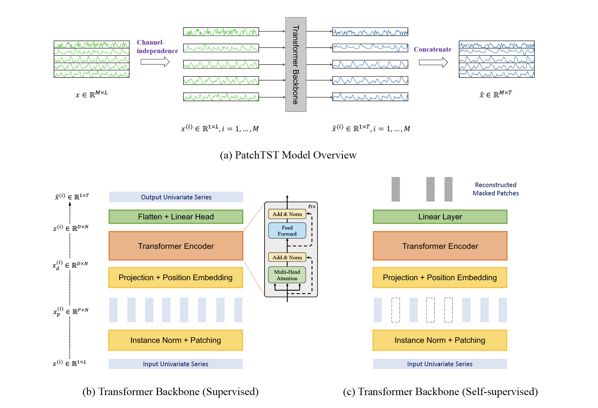

* **Work flow of PatchTST**: A multivariate time series sample is first split into separate univariate series  ($x^{(i)}$, one for each variable/channel). Each univariate series is normalized and then divided into fixed-length patches ($x_p^{(i)}$, subsequences). These patches are linearly projected and enriched with positional encoding to retain the order of the time steps. Each channel is processed **independently through a shared Transformer encoder**, where the attention mechanism captures temporal patterns within each series. The encoded patch representations are then flattened and passed through a linear layer to generate the future predictions for each channel. Finally, all channel outputs are combined to form the multivariate forecast.
* **Innovations**: 
  * Channel-Independent Processing
  * Patch-Based Input Representation: reduce the complexity while using **positional embedding to capture the information between each patch**

### [TSMixer](https://arxiv.org/pdf/2306.09364)

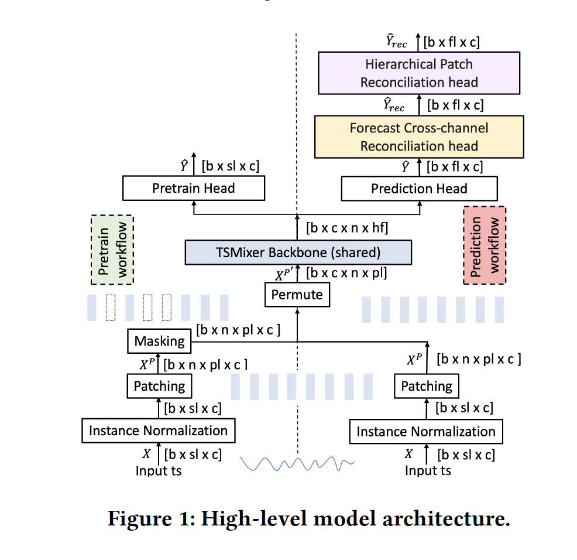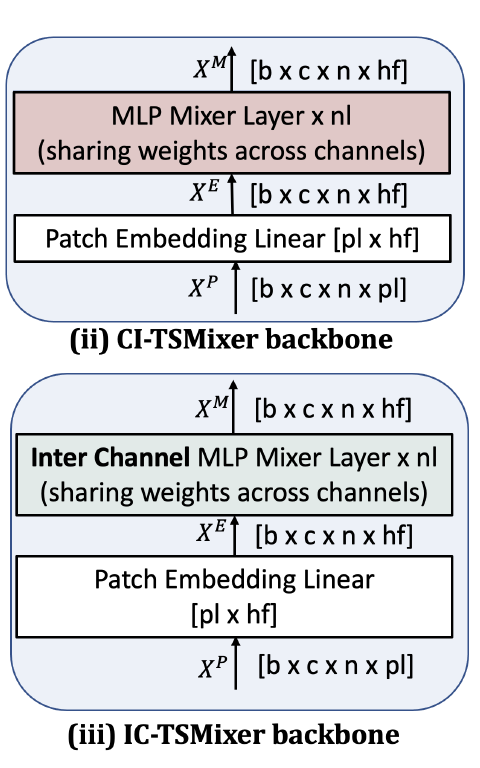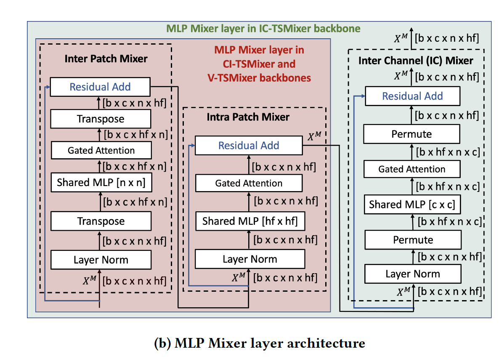

* **Work flow of TSMixer**: A multivariate time series sample is first normalized using instance normalization. Then, each univariate channel is divided into patches (small segments), and these patches are reshaped and passed into the TSMixer backbone, which consists of **stacked MLP-Mixer layers**. These layers capture dependencies between patches (temporal), within-patch features, and (optionally) across channels. A **lightweight gated attention** mechanism within each mixer block helps the model focus on important features. After the backbone, a prediction head generates the base forecast. Optionally, two online reconciliation heads refine the forecast: one adjusts it based on cross-channel relationships, and the other ensures consistency across temporal hierarchies (like patch-level aggregations). The final output is a tuned multivariate forecast.
* **Innovations**: Unlike PatchTST, TSMixer use MLP-only layer to capture the information **between patches**, and also **dependence information between channels**. TSMixer achieved these by using **permutations and shared matrix across other fixed dimensions**.

### [TTM](https://arxiv.org/pdf/2401.03955)

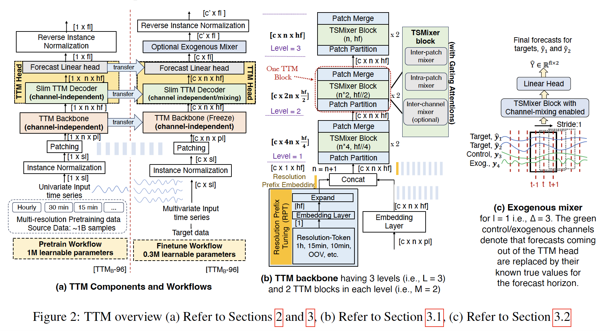

* **Work flow of TTM**: A multivariate time series sample is first normalized per channel, then split into non-overlapping patches. Each channel is **treated independently**, and the patches are embedded into a hidden space. A **resolution prefix token** may be prepended to inform the model of the time resolution (e.g., hourly or minutely). The patched sequence is passed through the TTM backbone, a multi-level stack of lightweight TSMixer blocks interleaved with **gated attention**, where patch dimensions are **adaptively reshaped at each level** to learn both local and global patterns. During fine-tuning, the backbone is frozen, and a slim **decoder with optional channel mixing** produces the initial forecast. If exogenous variables are available, they are fused using an **exogenous mixer**, which patches and mixes the known future values with forecasted targets to refine the prediction. Finally, the output is passed through a linear head and reverse-normalized to produce the final multivariate forecast.
* **Innovations**
  * Using **Adaptive Patching (AP)** and **Resolution Prefix Tuning (RPT)**, TTM generalizes well on datasets with different resolutions. It capture the information of different length pattern (resolution)  by using multiple layers of TSMixer block specifying different input lengths.
  * Only considering the channel-independent situation in pre-trained model, **leaving the fine-tune part (Decoder) to capture the dependence between channels** enlarges the datasets to pre-train the model, enhanced the performance.
  * Using **Exogenous Mixer** to learn lagged dependencies between known future exogenous inputs and target variables for more accurate forecasting.

---

## 3. Notebooks Results

### A. [Get started withe TinyTimeMixer(TTM)](https://github.com/ibm-granite/granite-tsfm/blob/main/notebooks/hfdemo/ttm_getting_started.ipynb)

This notebook shows how an example to use TTM (changing loss function, context/forecast length, zero/few-shot) on data [ETTH1](https://raw.githubusercontent.com/zhouhaoyi/ETDataset/main/ETT-small/ETTh1.csv). Also, I perform the same task on simulated [Mackey-Glass Time Series](https://www.kaggle.com/datasets/arashabbasi/mackeyglass-time-series) with 11000 time steps. Here are the results. For simplicity, I use 512-96 to represent context length 512 and forecast length 96

* ETTH1, Zero-shot, 512-96

  
Time Series plot

  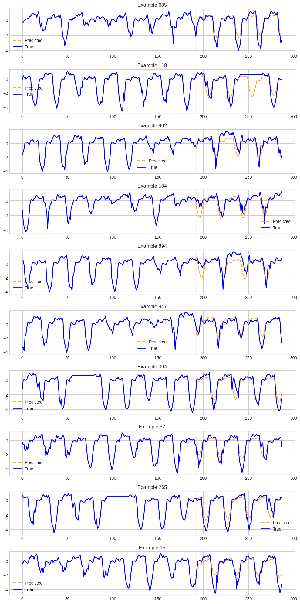

* ETTH1, few-shot, 512-96, MSE loss

  
Time Series plot

  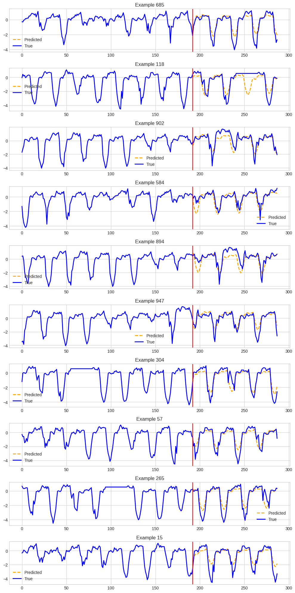

* EHHT1, few-shot, 512-96, quantile loss

  
Time Series plot

  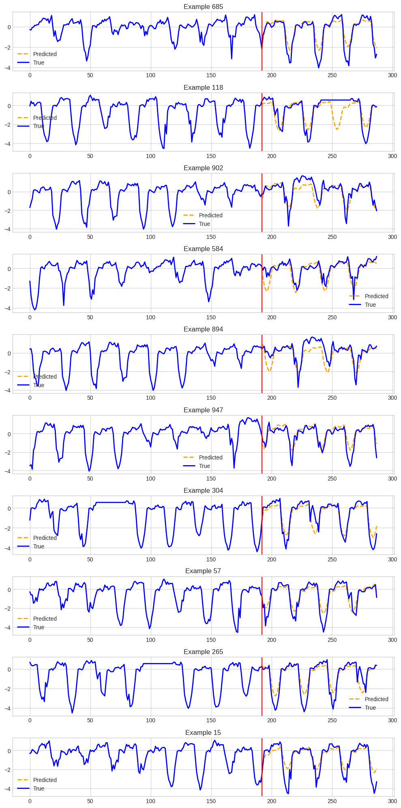

* EHHT1, zero-shot, 1024-48

  
Time Series plot

  

* EHHT1, few-shot, 1024-48

  
Time Series plot

  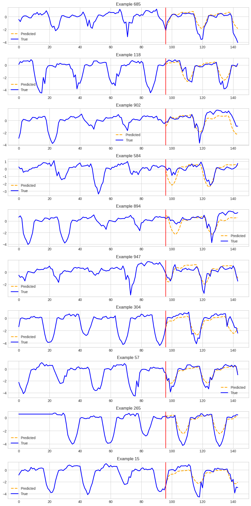

* MG, zero-shot, 512-96

  
Time Series plot

  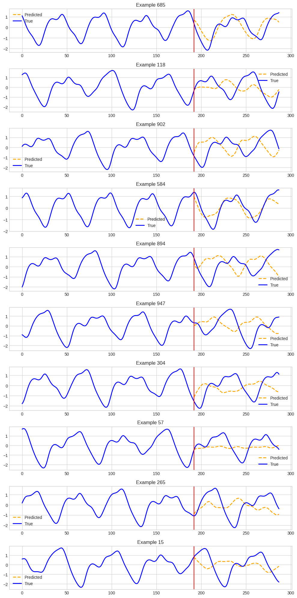

* MG, few-shot, 512-96, MSE loss

  
Time Series plot

  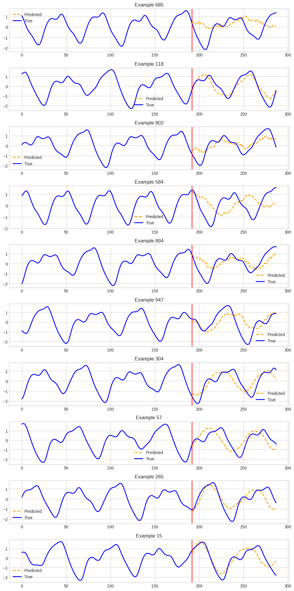

* MG, few-shot, 512-96, quantile loss

  
Time Series plot

  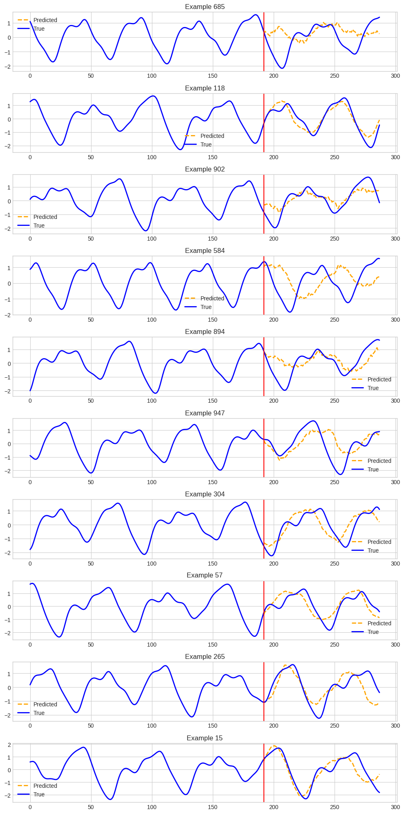

* MG, zero-shot, 1024-48

  
Time Series plot

  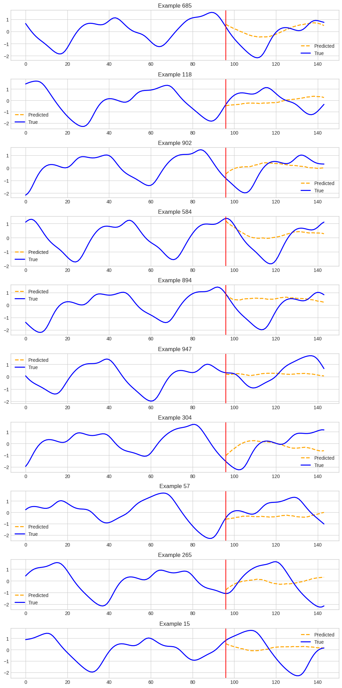

* MG, few-shot, 1024-48

  
Time Series plot

  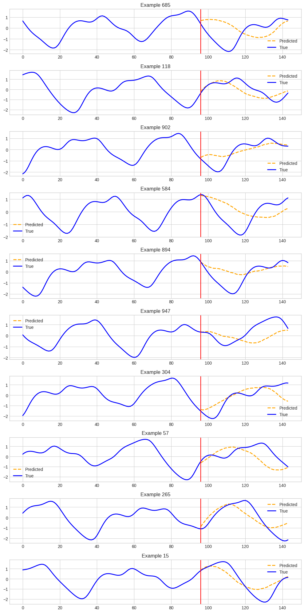

Here is the test MSE:

* EHHT1

|  | 512-96 MSE  |512-96 quantile |1024-48|
| ---- | ---------- | --------------- | ------- |
| zero-shot | 0.363 |/|0.333|
| few-shot| 0.362  |0.362|0.333|

* Mackey-Glass

|      | 512-96 MSE | 512-96 quantile | 1024-48 |
| ---- | ---------- | --------------- | ------- |
| zero-shot | 1.122 |/|1.010|
| few-shot|    0.693  |0.726|0.682|

* **Insights**: We can see from the table that:
  * Over ETTH1, the loss after and before fine-tuning does not differ a lot, indicating good performance of the pre-trained model
  * Over Mackey-Glass time series data, the loss decreased a lot after fine tuning, indicating the transfer part can make the model well fit to some dataset that is far from training dataset. 
  * Although fine tuning decreased the loss a lot, but is is far from satisfaction, indicating the lack of ability to capture chaotic dynamics
  * Lengthen the context length and shorten the forecast length can decrease the loss significantly on ETTH1 (real world data), while the loss on MG remains almost unchanged. Which is reasonable since the information of previous time step can last at most $\tau$ steps according to its formula, $\frac{dx(t)}{dt} = \beta \frac{x(t - \tau)}{1 + x(t - \tau)^n} - \gamma x(t)$

### B. [Getting started with TinyTimeMixer (TTM) Rolling Predictions](https://github.com/ibm-granite/granite-tsfm/blob/main/notebooks/hfdemo/ttm_rolling_prediction_getting_started.ipynb)

  
See full details

  This notebook showed the rolling prediction by the TTM, context length 512 and forecast length 96, on the data ETTH1.  For the rolling prediction length 192, the zero shot MSE is 0.392. Here is the prediction plot

  

    
Time Series plot

    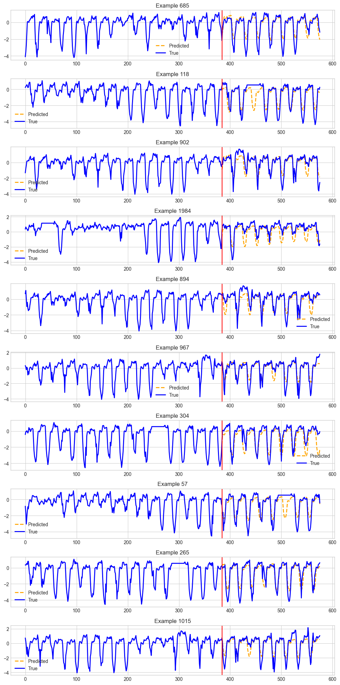
  

  * **Insight**: We can see that though we use the rolling prediction, but the loss did not increase largely, indicating that this model performs very well on prediction of ETTH1.

### C. [Getting started with PatchTSMixer](https://github.com/ibm-granite/granite-tsfm/blob/main/notebooks/hfdemo/patch_tsmixer_getting_started.ipynb)

  
See full details

  This notebook showed the how to use the pre-trained model (trained in ETTH1) on ETTH1, also showed how to change hyper-parameter and change the target channel during training from scratch. Both the pre-trained model and model training from scratch got evaluation loss around 0.368.

  * Pre-trained:

  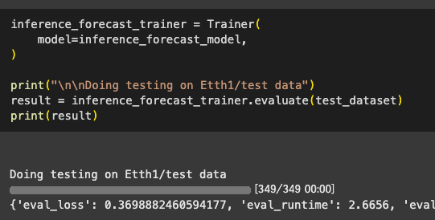

  * Train from scratch:

  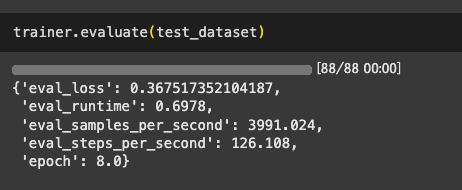

  * **Insights**: We can see the evaluation loss is not far from TTM, which is reasonable since the most advantage of TTM is that it is pre-trained and can generalize well.

### D. [Patch Time Series Mixer for Transfer Learning across datasets](https://github.com/ibm-granite/granite-tsfm/blob/main/notebooks/hfdemo/patch_tsmixer_transfer.ipynb) 

  
See full details

  This notebook showed how to do transfer learning of TSMixer. Firstly, this model is pre-trained on the [ECL](https://github.com/zhouhaoyi/Informer2020) data, and then use the saved model to predict on the ETTH2 dataset. It used the zero-shot, linear probing and the full fine-tune:

  * Zero-shot

  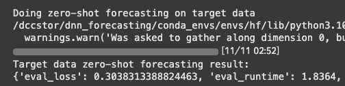

  * Linear probing

  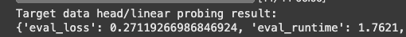

  * Full fine-tune:

  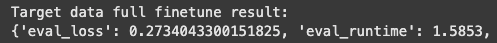

  * **Insights**: evaluation loss decreases lot on the linear probing but increase when doing full fine-tuning. Indicating that for ETTH2, linear probing is enough.

### E. [PatchTSMixer in HuggingFace - Getting Started](https://github.com/ibm-granite/granite-tsfm/blob/main/notebooks/hfdemo/patchtsmixer_HF_blog.ipynb)

The same with D. [Patch Time Series Mixer for Transfer Learning across datasets](https://github.com/ibm-granite/granite-tsfm/blob/main/notebooks/hfdemo/patch_tsmixer_transfer.ipynb)

 ### F. [PatchTSMixer in HuggingFace - Getting Started](https://github.com/ibm-granite/granite-tsfm/blob/main/notebooks/hfdemo/patch_tsmixer_blog.ipynb)

The same with D. [Patch Time Series Mixer for Transfer Learning across datasets](https://github.com/ibm-granite/granite-tsfm/blob/main/notebooks/hfdemo/patch_tsmixer_transfer.ipynb)

### G. [Getting started with PatchTST](https://github.com/ibm-granite/granite-tsfm/blob/main/notebooks/hfdemo/patch_tst_getting_started.ipynb)

  
See full details

  This notebook showed the how to use the pre-trained model (trained in ETTH1) on ETTH1, also showed how to change hyper-parameter and change the target channel during training from scratch. 

  * Pre-trained:

  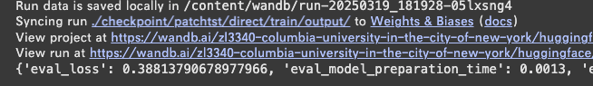

  * Train from scratch:

  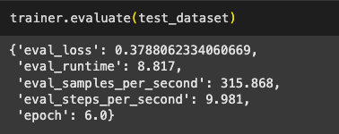

### H. [Patch Time Series Transformer for Transfer Learning across datasets](https://github.com/ibm-granite/granite-tsfm/blob/main/notebooks/hfdemo/patch_tst_transfer.ipynb)

  
See full details

  This notebook showed how to do transfer learning of PatchTST. Firstly, this model is pre-trained on the [ECL](https://github.com/zhouhaoyi/Informer2020) data, and then use the saved model to predict on the ETTH2 dataset. It used the zero-shot, linear probing and the full fine-tune:

  * Zero-shot:

  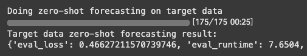

  * Linear probing:

  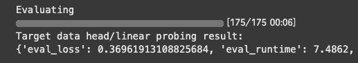

  * Full fine tune:

  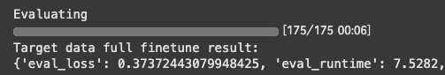

  * **Insights**: evaluation loss decreases lot on the linear probing but increase when doing full fine-tuning. Indicating that for ETTH2, linear probing is enough.

---

## 4. Experiments

The following method is focused on the prediction of a chaotic dynamic systems' data

### A. Few-shot percentage vs Time delay

This experiment mainly consider the performance of the model with different percentage in the few-shot training over different MG data with different time delay $\tau$.

Firstly, in the TTMs, the percentage in few-shot means the fraction of samples for fine-tuning (slicing windows with $length = context \ length+forecast \ length$). In our experiment,  we chose context length 512 and forecast length 96. So if we have the 6000 time entries to train, we could have 6000-(512+96)+1 =5,393 samples, each consist of an input $x\in\mathbb{R}^{512}$ and output $y \in \mathbb{R}^{96}$. For example, denote the time series $ \{x_i \}_{i=1}^{6000} $, then first sample is $(x_1,...,x_{512})$ combined with output $(x_{513},...x_{608})$, and the second sample is $(x_2,...,x_{513})$ combined with output $(x_{514},...,x_{609})$. Then in the fine tuning, for example 5% few-shot, 5393*5% samples will be uesd to train the model

There are three ways to select the training samples, from start, last and randomly choose from training dataset. We will do both the last position and the uniformly choosing.

For simulation of the MG data, I take the [tutorial](https://www.mathworks.com/matlabcentral/fileexchange/24390-mackey-glass-time-series-generator) for reference, using the Runge-Kutta method to numerically approaching the derivative. Here is a scratch:

To generate

$$
\frac{dP(t)}{dt} = \frac{\beta\theta^nP(t-\tau)}{\theta^n+P(t-\tau)^n}-\gamma P(t)
$$

We use the Runge-Kutta method, with $\frac{dy}{dt} = f(t,y)$ known:

$$
\begin{aligned}
y_{n+1} &= y_n + \frac{h}{6}(k_1+2k_2+2k_3+k_4)\\
t_{n+1} &= t_n+h\\
k_1 & = f(t_n,y_n)\\
k_2& = f(t_n+\frac{h}{2},y_n+h\frac{k_1}{2})\\
k_3 &= f(t_n+\frac{h}{2},y_n+h\frac{k_2}{2})\\
k_4 & = f(t_n+h,y_n+hk_3)
\end{aligned}
$$

In the implementation of the method, we fixed the $P(t-\tau)$ in the computation of $k_1,...,k_4$ even though the $t should change according to the formula. 

We chose the parameters to be $\theta = 0.2,\beta = 0.2,\gamma = 0.1,n = 10,\tau\in\{20,30,40,100\}$. 

For more different performance of different parameters, see the streamlit scratch.

Firstly see the MG data:

* $\tau = 20$:

  
 Time series plot 

  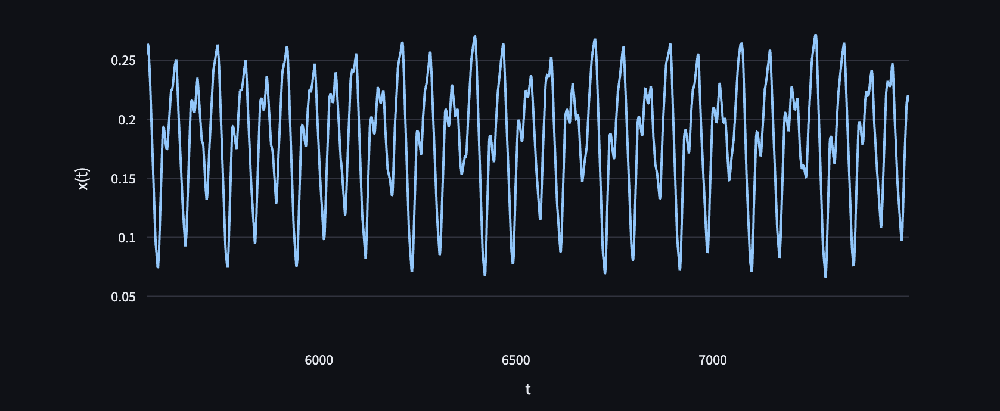

* $\tau = 30$:

  
 Time series plot 

  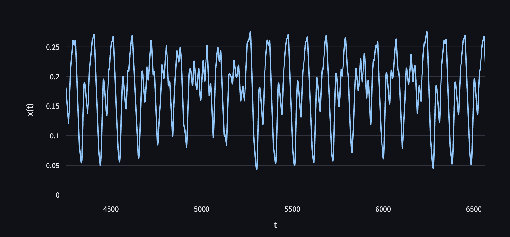

* $\tau = 40$:

  
 Time series plot 

  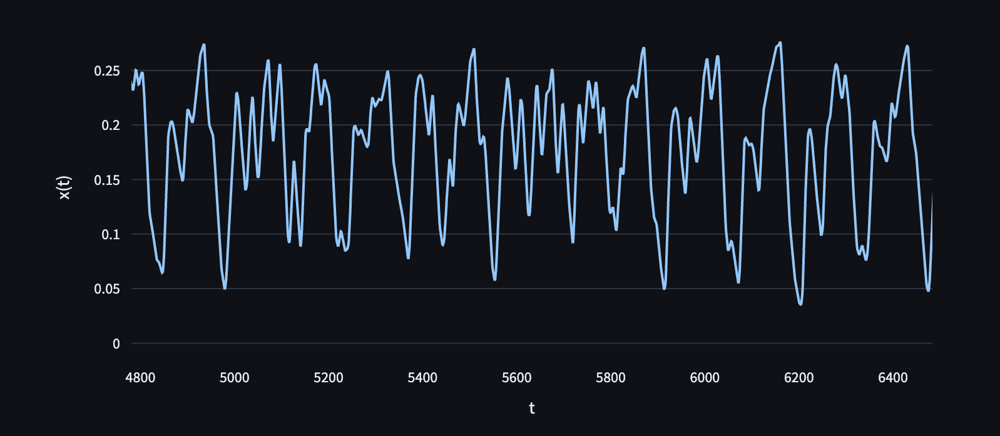

* $\tau = 100$:

  
 Time series plot 

  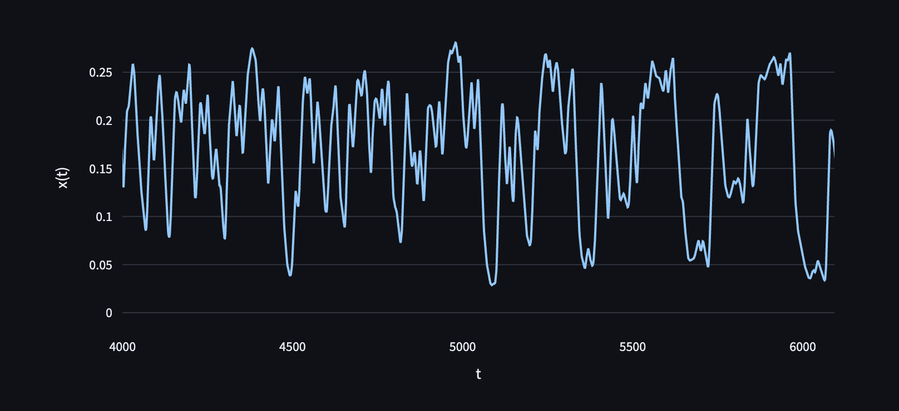

Here the table of MSEs

* Select from last position

|$\tau$|Zero-shot|5%|20%|30%|40%|50%|75%|
|---|---|---|---|---|---|---|---|
|$\tau$=20|1.120|0.870|0.734|0.692|0.334|0.192|0.103|
|$\tau$=30|1.198|0.923|0.678|0.480|0.403|0.379|0.221|
|$\tau$=40|0.245|0.212|0.251|0.113|0.067|0.047|0.047|
|$\tau$=100|1.186|0.989|0.879|0.371|0.234|0.181|0.137|

* Select randomly

||Zero-shot|5%|20%|30%|40%|50%|75%|
|---|---|---|---|---|---|---|---|
|$\tau$=20|1.120|0.492|0.221|0.195|0.136|0.117|0.087|
|$\tau$=30|1.198|0.563|0.298|0.250|0.221|0.211|0.196|
|$\tau$=40|0.245|0.199|0.109|0.087|0.067|0.063|0.047|
|$\tau$=100|1.186|0.467|0.267|0.225|0.191|0.178|0.137|

Some of the forecast plots:

* $\tau = 100$, 20% few-shot, location = UNIFROM

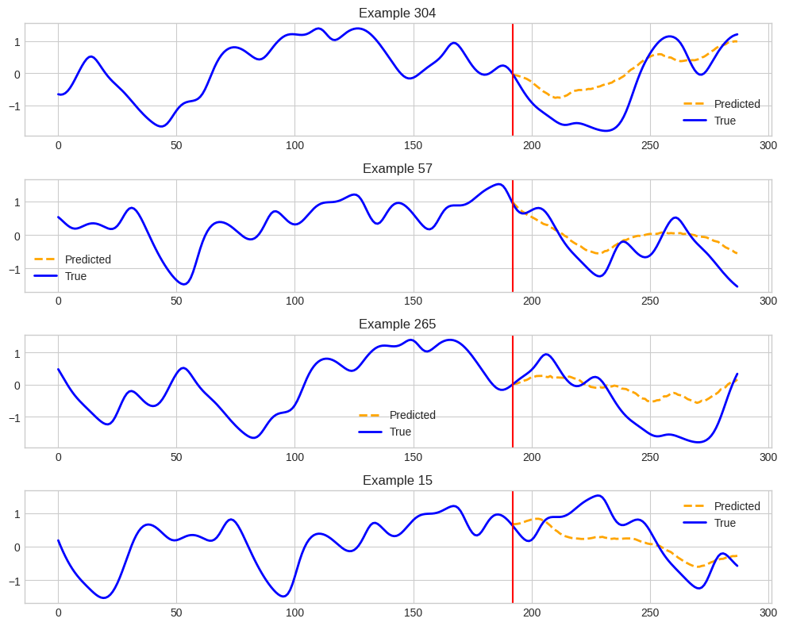

* $\tau = 40$, 20% few-shot, location = LAST

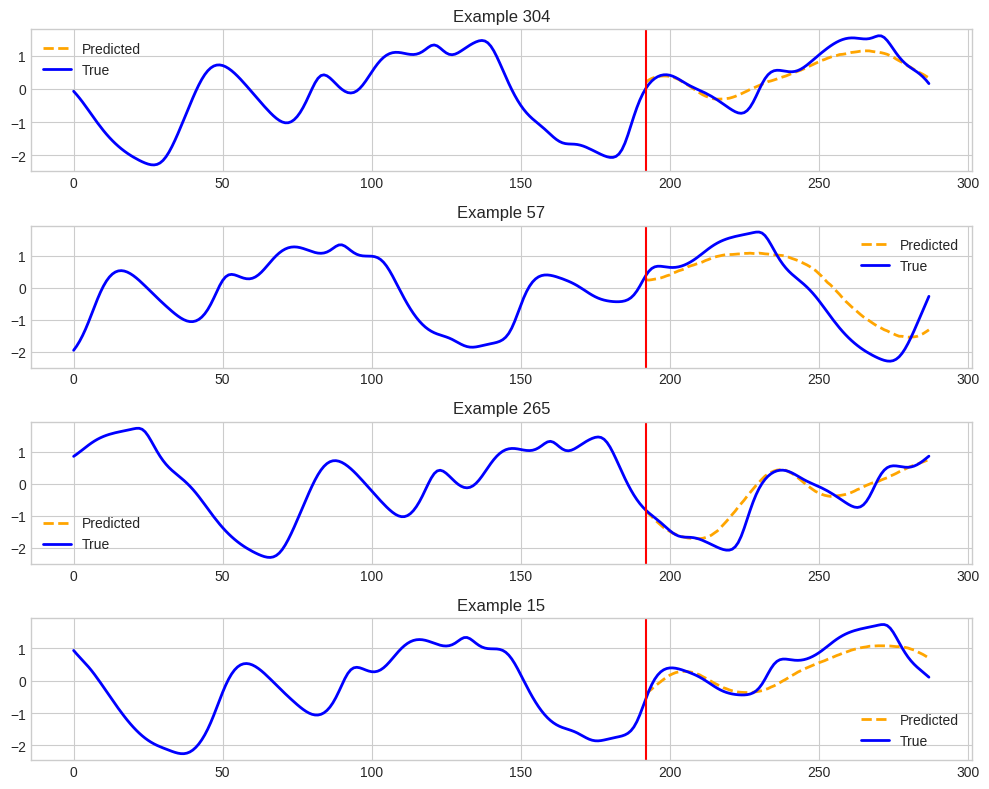

Results show that both strategies significantly outperform the zero-shot baseline, even with as little as 5% of training data. However, in low-data regimes (5–30%), random sampling consistently leads to lower MSE compared to selecting from the end of the time series. This suggests that random sampling provides better distributional coverage, which benefits generalization. As the training fraction increases (≥50%), the performance gap between the two strategies narrows, indicating that either strategy becomes sufficient when ample data is available. Also, for different time delay, the models perform pretty much the same, except when $\tau=40$ the zero-shot model performs extremely well resulting all models perform better than other time delay. And the model performs little worse at $\tau= 30$ which is unexpected since the larger the $\tau$ is the more chaotic the times series is.

### B. did this model learn chaos?

Firstly, the method to generate is updated by the Runge-Kutta method combined with linear interpolation, [specified to generate the DDE time series](https://academic.oup.com/book/7531/chapter-abstract/152490685?redirectedFrom=fulltext). Note that, though compared to MGdata generated by Eular method through comparing maximal lyapunov exponent, due to limitations of accuracy in [numerical method](https://cschoel.github.io/nolds/nolds.html#lyapunov-exponent-rosenstein-et-al), the behaviour of RK4 method and the modified RK4 method are similar. We will use the modified RK4 method to generate MGdata used in this experiment.For full details of MGdata from different parameters, please see the [streamlit app](https://ttmstry-jcda6waumgfhufuhvdci6w.streamlit.app/)

**RK4 Interpolation Method**:

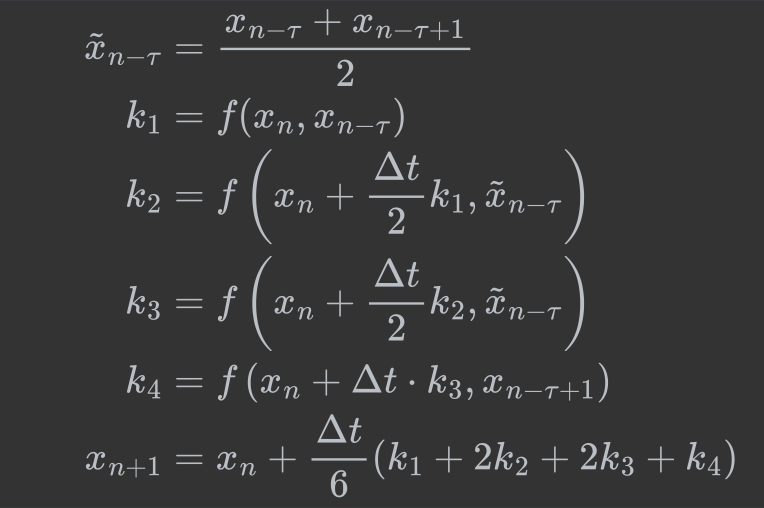

Here are data plots generated by different numerical method with same parameters

* RK4

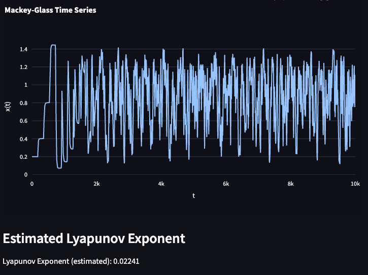

* Eular 

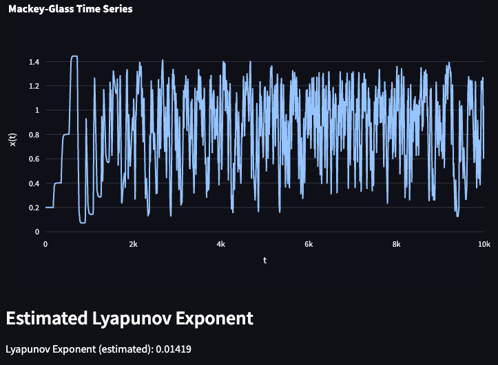

* RK4+interpolation

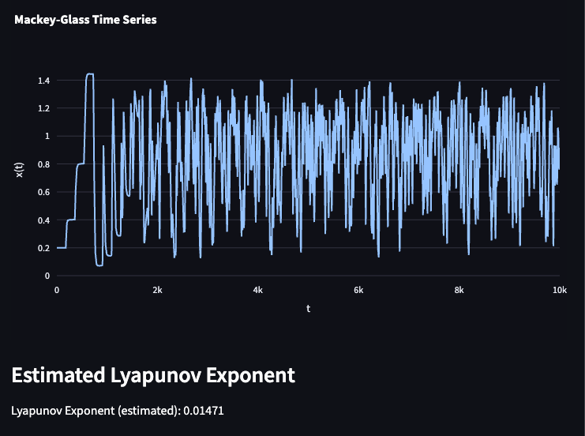

For the experiment, here is the absolute difference between mean value of l.e. of true prediction and the mean value of l.e. of prediction against different $x0$ and $\tau$ with few-shot fraction fixed at 75%

* select training data from last position

||$x_0 = 0.2$|$x_0 = 1$|$x_0 = 5$|$x_0 = 8$|
|---|---|---|---|---|
|$\tau = 60$|0.005|0.003|0.007|0.014|
|$\tau = 120$|0.004|0.003|0.005|0.011|
|$\tau = 120$|0.008|0.006|0.006|0.003|

* select training data randomly

||$x_0 = 0.2$|$x_0 = 1$|$x_0 = 5$|$x_0 = 8$|
|---|---|---|---|---|
|$\tau = 60$|0.005|0.004|0.005|0.013|
|$\tau = 120$|0.005|0.003|0.002|0.008|
|$\tau = 120$|0.009|0.004|0.005|0.001|

* comments:
  * the absolute difference between mean value of l.e. of last 96 of history and the mean value of l.e. of prediction are not listed here, since they are very similar, within the range of $\pm0.001$.
  * here only list the different between mean value, since for single sample, the difference on lyapunov exponent varies strongly.
  * when computing the l.e. of these predictions, the best value of parameter (min_tsep) in the function to compute cannot reach due to too little points, so I replace it with the max value the function can work.
  * there is huge difference between overall l.e and l.e. of predictions for unknown reasons. one possible cause is the last point I mentioned.
  * for more illustrations see the streamlit app.

### C. Can TTMs **truly** learn chaos?

For experiment B, there are some drawback:
* lyapunov exponent should stay relatively stable when changing initial value or computing window (the window of time entries input to the function to compute the lyapunov exponent), which is not verified in the experiment
* when measure the ability of long term prediction (important for chaotic dynamic system), we should consider the burning period: the first range of predictions where length equals to the context length. $i.e.$, if the context length is 512, then we should not consider the performance of the first 512 predictions when we want to measure the ability of long term prediction.

In this experiment, we change the way to compute the parameters in the function of [nolds.lyap_r](https://cschoel.github.io/nolds/nolds.html#lyapunov-exponent-rosenstein-et-al). Firstly, for the min_tsep, we do not use the 0 padding (used in default in the built-in function of lyap_r) in computing the Fast Fourier Transform to make it more accurate. Secondly, we use the [first minimum of the average mutual information](https://journals.aps.org/pra/abstract/10.1103/PhysRevA.33.1134) to compute the optimal time delay.

For the experiment process, we first fix all the parameters of MG data sets except $\tau\in \{60,120,200\}$. Other parameters are: $\gamma = 0.1,\beta=0.2,\theta = 1,n=10,x_0 = 1$. We generated 12000 time entries where the first 6000 are sliced for fine-tuning with fraction choice $\{ 5 \%,30 \%,75 \% \}$, also with location options uniformly choosing or choose from the last sample. Then we do rolling prediction with the trained model and on the sliced windows of time entries 9000-10000(the last 2000 time entries are used for comparing the prediction). The context length is 512 and prediction length 96 with 17 times of repeatition of prediction with updated context gaining from last prediction. At the $7_{th}$ prediction, a perturbation of $0.05$ is applied to the last time entry of context, and then do prediction over both non-perturbed sample and perturbed sample. Here are the results.

In this experiment, we firstly we compare the lyapunov exponent:

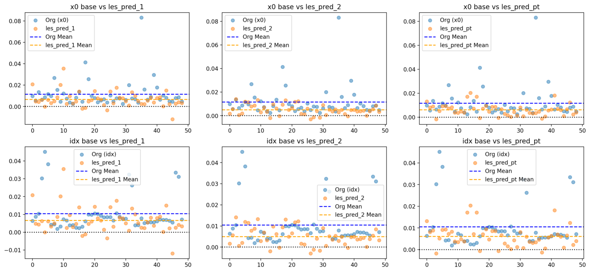

In these plots, blue point on the the plots of the first row indicates lypunov exponent computed from the same Mackey Glass system with different initial values. Blue points on the plots of the second row indicate lyapunov exponents computed from the same Mackey Glass system with different window sliced with same length from the same simulation time series. Orange points from the first, second, thrid column represent the lyapunov exponent from the prediction window $576-1076$, $1056-1556$, and the prediction on the 0.05 perturbed data at the $1056_{th}$ predictions respectively.

Then we see the time series plot:

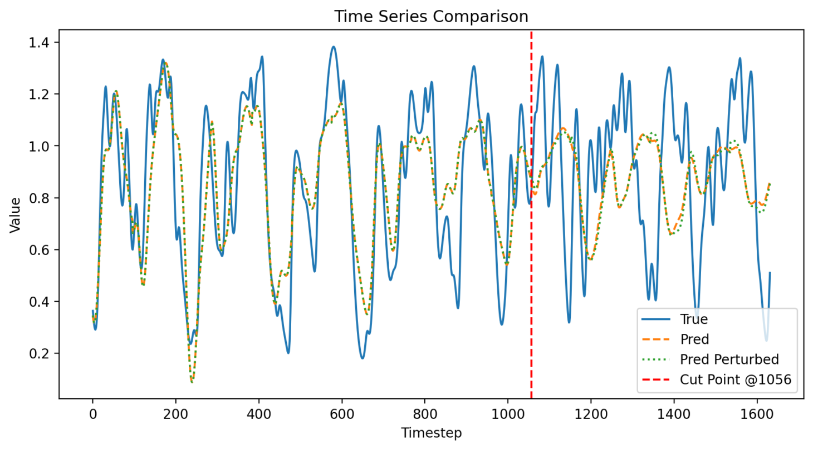

The above plots is plotted with condition: $\tau = 60$, fraction of fine-tuning is 75%, chosen from the last point. For $\tau =200$, please see here:

  
plots

  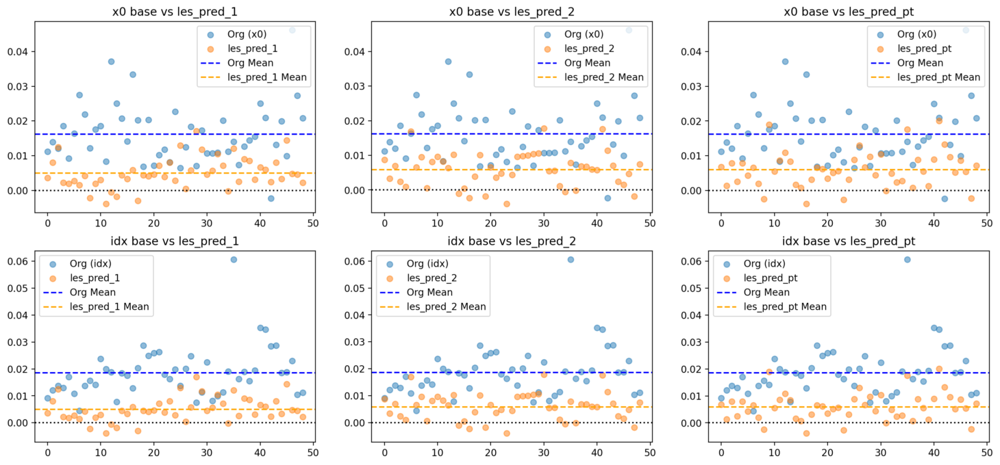
  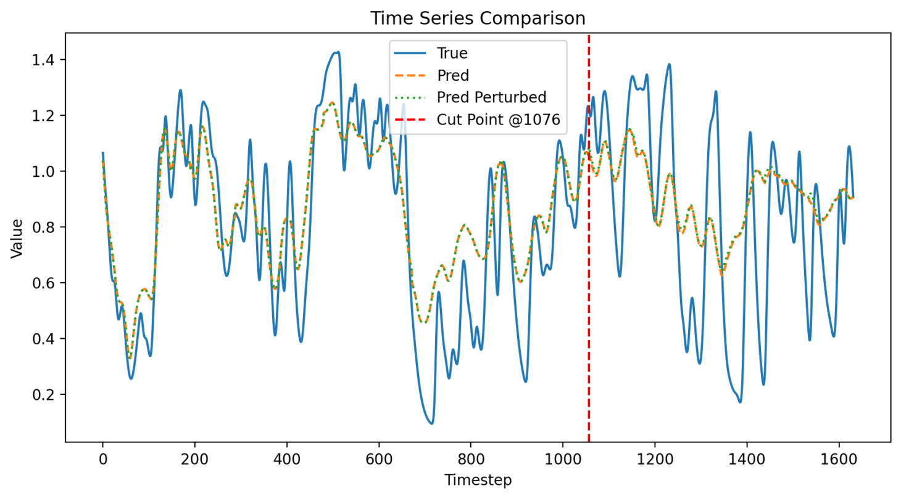

For other parameter combinations, please see the deployed [streamlit app](https://ttmstry-gdxry3c8myxwyqn2qeqj9x.streamlit.app/)

* comments

  * TTMs can predict the “patterns” (lyapunov exponent, or the delay embeddings) in some sense when tau is relatively small (60).
  * But for the actual prediction value, it is far away from the original data
  * For large tau (200), both the pattern and the prediction value are not satisfactory.

---

## 5. Summary

### General Performance

This report explores and evaluates the **Tiny Time Mixers (TTM)** model by comparing it with related models (**PatchTST** and **TSMixer**) and running experiments on real-world and synthetic time series datasets. The study highlights the following key takeaways:

- **Architecture-wise**, TTM adopts and enhances ideas from PatchTST and TSMixer:
  - It uses **adaptive patching** and **resolution prefix tuning** to generalize across datasets with different temporal resolutions.
  - By **freezing the backbone** during fine-tuning and focusing channel dependencies in the decoder, TTM supports large-scale pretraining without losing flexibility.
  - The **Exogenous Mixer** module makes it capable of incorporating known future variables for improved forecasting.
- **Experimental results** show:
  - TTM performs **strongly out-of-the-box** (zero-shot) on standard datasets like ETTH1.
  - It also **adapts well through fine-tuning** to datasets with different dynamics, such as the Mackey-Glass time series.
  - However, its performance on chaotic time series (like Mackey-Glass) remains limited, suggesting room for improvement in handling non-linear dynamics.
- **Model transfer experiments** with TSMixer and PatchTST reveal that:
  - **Linear probing** is often sufficient for transfer learning and outperforms full fine-tuning in some cases.
  - Pre-trained models can match or exceed models trained from scratch, especially when data distributions are similar.

Overall, **TTM is a powerful and lightweight solution** for time series forecasting that balances pretraining efficiency with flexible adaptation. Future work can focus on better capturing chaotic behavior and further optimizing fine-tuning strategies.

---
